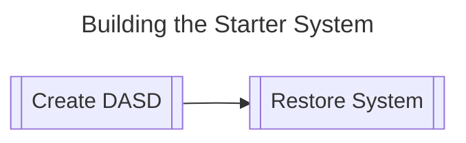

# Building the starter system

We will be following IBM's original installation instructions (with some additional steps from Jay Moseley's instructions and some custom changes for this distribution).


## The components of the Starter System

The **Starter System** contains the following emulated hardware:

| Device Name | Device Type | Location/Address | 
|-----|-----|----|
| Starterer System DASD | build/starter/start1.3350 | 150|
| Starter System Spool DASD | build/starter/spool1.3350 | 151 |
| Starter System Console | telnet localhost:3270 | 009 |
| 3420 Tape Drive | IBM/tapes/starter/vs2start.het | 280 | 
| 3420 Tape Drive | IBM/tapes/starter/vs2spool.het | 281 |
| 1442 Card Reader | build/starter/instart1.sajob | 00c |
| 1442 Card Reader | build/starter/rsstart1.sajob | 00d |
| 1442 Card Reader | build/starter/inspool0.sajob | 00e |
| 1442 Card Reader | build/starter/inspool0.sajob | 00f |

This process uses the **DASDI 7.80** and **DUMP/RESTORE 7.83** utilities to process the build.

## Procedure to build the Starter System

During the building of the Starter System our emulated mainframe will use a custom configuration of attached devices described by a Hercules/390 configuration file.

The various tapes will be automatically mounted (devinit'd) to have the emulated tapes available to the starter system on the emulated mainframe.

1. Create our emulated DASDs for the Starter System. 

2. Use our new compressed emulated DASD with Hercules and our JCL jobs to build and restore the Starter System to these new disks.




## 1. Create our emulated DASDs for the Starter System

Before we can do anything we must first unpack our all of our hardware and attach them together. In the real world this would include:

- Unpacking the main processing unit and building the cabinet up with the power supplies, CPUs and other components
- Unpacking the various I/O and Communication controllers that controlled DASD, tape drives, various terminals and other devices
- Unpacking the various DASD devices and connect them to the their designated I/O controller according to the System Generation design document that IBM pre-prepared in advance with the customer. Similarly, the same would happen with the tape drives and terminals each connecting to the appropriate controller.

In our emulated world, this is simply done by creating a Hercules configuration file that tells Hercules which devices it needs to emulate and what addresses they are supposed to be attached to (in order that the running operating system can talk to the Hercules emulator).

Our first step in our emulated mainframe is therefore to create the emulated DASD for the starter system.

### Windows

In our distribution we have included a installation of Hercules in the directory hercules/windows. This includes both the Hercules/390 emulator itself plus a bunch of utilities that the user can use to help in everything from creating emulated DASD and tapes to Wintail (named *tail* in the directory) which allows us to follow the output of a textfile (like the printer output).

To create a new DASD device we use the *dasdinit* command to generate an appropriate emulated device specifying the appropriate device type and volume ID.

To make it easier in the *build/starter* directory we have included a Windows batch script **create_starter_dasd**  which creates the appropriate DASD devices for the starter system.

From the base directory of the distribution, run the following commands in a Windows Terminal or CMD command shell.
```cmd
cd build\starter
create_starter_dasd
```

You will now have two files in **build\starter** that are compressed emulated DASD devices called **start1.3330** and **spool0.3330** which we will now use to create our *Starter System*.

### Linux 

The distribution includes a platform independant binary installation of Hercules/390 in the distribution subdirectory *hercules/linux/x64/bin*. The included scripts in this distribution are setup to use this built-in Hercules/390 emulator and utilities. The user can install their distributions version if they like but the shell scripts will setup the $PATH environment variable to use the local version by default. If the user prefers their distribution version of Hercules instead, please amend the scripts removing the change to the PATH env variable.

The distribution has included a shell script *create_starter_dasd.sh* in the build/starter directory. To use this script, run the following from the distribution directory in your shell:

```sh
cd build/starter
./create_starter_dasd.sh
```


Alternatively, the user can issue the DASD utility command manually from the distribution directory in the shell:

```sh
cd build/starter
dasdinit -z -a start1.3330 3330 111111
dasdinit -z -a spool0.3330 3330 222222
ls -l
```

This will execute the dasdinit utility in your path (the shell script modifies the PATH environment variable to force the local dasdinit tool in hercules/linux/x64/bin).

You will now have two files in **build\starter**  that are compressed emulated DASD devices called **start1.3330** and **spool0.3330** which we will now use to create our *Starter System*.

## 2. Build and restore the Starter System

From a terminal (shell or Windows Terminal) or command window (Windows):

1. Make sure you are in the distribution directory (cd if necessary)

2. Start Hercules with the following configuration file:

> [!TIP]
> You should have already setup your PATH environment variable to point to the distribution's local installation of Hercules/390 binaries of the emulator and utilities.

Issue the command:

```
hercules -f build/starter/ibcdmprs.cnf
```

Hercules will start up and start it's initialization. After connecting all the devices specified in the [ibcdmprs.cnf configuration file](starter/ibcdmprs.cnf) we see the following:

  

This is the **Hercules Command Window** where you can enter commands to the emulator.

If you press ESCAPE on this screen you activate a toggle switching between the HERCULES COMMAND WINDOW and the HERCULES CONTROL PANEL shown below

  

The HERCULES CONTROL PANEL shows the registers and buttons on the left and a list of addresses of devices on the right. If you press the **?** key you are presented with a list of commands you can issue in this view.

 
3. IPL from tape at address 280

Enter the following command in the Hercules COMMAND Window:

```
ipl 280
```

Alternatively, hit ESCAPE to switch to the CONTROL PANEL and then press 

```
L
H
```

This presses the IPL button and then selects device *H* 

> H 0280 3420 TAPE IBM/tapes/starter/vs2start.het [1:00000000]  IO[793]

Pressing the IPL button in this manner issues the IPL 280 command at the HERCULES COMMAND WINDOW. This can be more satifying to the user as an emulation than typing *IPL 280* and is included as an alternative method.


----


> If the user wishes they can use a GUI front end to Hercules like any of the following.
>
>Windows:
>- [HercGUI by Software Development Laboratories](http://softdevlabs.com/hercgui.html)
>- [Jason by Olly](https://www.ollydbg.de/Jason/index.htm)
>
>Linux:
>- [HRDPLEX-GUI](https://github.com/haynieresearch/hrdplex-gui)
>   

---

You should not get any errors with the HET tapes provided in the distribution if you use the included Hercules as described. 

> If you receive the error message: 
> 
>   HHCCP029E S/370 mode IPL failed: CSW status=0D00
> 
> Jay Moseley recommends first check the validity of the archive that contains the tape images and the tape images themselves after they are extracted using the MD5 sums provided, and verify that the tape images were extracted to the tape directory.  If the MD5 sums prove the tape images are valid, ensure that your version of Hercules has been built with zlib and bzip support.  These are the three reasons that can cause this error message from the Hercules emulator.

