# Building the starter system

We will be following IBM's original installation instructions (with some additional steps from Jay Moseley's instructions and some custom changes for this distribution).


## The components of the Starter System

The **Starter System** contains the following emulated hardware:

| Device Name | Device Type | Location/Address | 
|-----|-----|----|
| Starterer System DASD | build/starter/start1.3350 | 150|
| Starter System Spool DASD | build/starter/spool1.3350 | 151 |
| Starter System Console | telnet localhost:3270 | 009 |
| 3420 Tape Drive | IBM/tapes/starter/vs2start.het | 280 | 
| 3420 Tape Drive | IBM/tapes/starter/vs2spool.het | 281 |
| 1442 Card Reader | build/starter/instart1.sajob | 00c |
| 1442 Card Reader | build/starter/rsstart1.sajob | 00d |
| 1442 Card Reader | build/starter/inspool0.sajob | 00e |
| 1442 Card Reader | build/starter/inspool0.sajob | 00f |

This process uses the **DASDI 7.80** and **DUMP/RESTORE 7.83** utilities to process the build.

## Procedure to build the Starter System

During the building of the Starter System our emulated mainframe will use a custom configuration of attached devices described by a Hercules/390 configuration file.

The various tapes will be automatically mounted (devinit'd) to have the emulated tapes available to the starter system on the emulated mainframe.

1. Create our emulated DASDs for the Starter System. 

2. Use our new compressed emulated DASD with Hercules and our JCL jobs to build and restore the Starter System to these new disks.


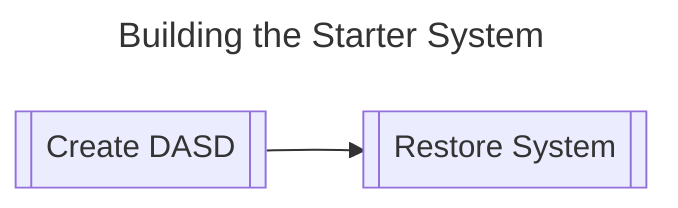

## 1. Create our emulated DASDs for the Starter System

Before we can do anything we must first unpack our all of our hardware and attach them together. In the real world this would include:

- Unpacking the main processing unit and building the cabinet up with the power supplies, CPUs and other components
- Unpacking the various I/O and Communication controllers that controlled DASD, tape drives, various terminals and other devices
- Unpacking the various DASD devices and connect them to the their designated I/O controller according to the System Generation design document that IBM pre-prepared in advance with the customer. Similarly, the same would happen with the tape drives and terminals each connecting to the appropriate controller.

In our emulated world, this is simply done by creating a Hercules configuration file that tells Hercules which devices it needs to emulate and what addresses they are supposed to be attached to (in order that the running operating system can talk to the Hercules emulator).

Our first step in our emulated mainframe is therefore to create the emulated DASD for the starter system.

### Windows

In our distribution we have included a installation of Hercules in the directory hercules/windows. This includes both the Hercules/390 emulator itself plus a bunch of utilities that the user can use to help in everything from creating emulated DASD and tapes to Wintail (named *tail* in the directory) which allows us to follow the output of a textfile (like the printer output).

To create a new DASD device we use the *dasdinit* command to generate an appropriate emulated device specifying the appropriate device type and volume ID.

To make it easier in the *build/starter* directory we have included a Windows batch script **create_starter_dasd**  which creates the appropriate DASD devices for the starter system.

From the base directory of the distribution, run the following commands in a Windows Terminal or CMD command shell.
```cmd
cd build\starter
create_starter_dasd
```

You will now have two files in **build\starter** that are compressed emulated DASD devices called **start1.3330** and **spool0.3330** which we will now use to create our *Starter System*.

### Linux 

The distribution includes a platform independant binary installation of Hercules/390 in the distribution subdirectory *hercules/linux/x64/bin*. The included scripts in this distribution are setup to use this built-in Hercules/390 emulator and utilities. The user can install their distributions version if they like but the shell scripts will setup the $PATH environment variable to use the local version by default. If the user prefers their distribution version of Hercules instead, please amend the scripts removing the change to the PATH env variable.

The distribution has included a shell script *create_starter_dasd.sh* in the build/starter directory. To use this script, run the following from the distribution directory in your shell:

```sh
cd build/starter
./create_starter_dasd.sh
```


Alternatively, the user can issue the DASD utility command manually from the distribution directory in the shell:

```sh
cd build/starter
dasdinit -z -a start1.3330 3330 111111
dasdinit -z -a spool0.3330 3330 222222
ls -l
```

This will execute the dasdinit utility in your path (the shell script modifies the PATH environment variable to force the local dasdinit tool in hercules/linux/x64/bin).

You will now have two files in **build\starter**  that are compressed emulated DASD devices called **start1.3330** and **spool0.3330** which we will now use to create our *Starter System*.

## 2. Build and restore the Starter System


### Initialize the START1 volume 

From a terminal (shell or Windows Terminal) or command window (Windows):

1. Make sure you are in the distribution directory (cd if necessary)

2. Start Hercules with the following configuration file:

> [!TIP]
> You should have already setup your PATH environment variable to point to the distribution's local installation of Hercules/390 binaries of the emulator and utilities.

Issue the command:

```
hercules -f build/starter/ibcdmprs.cnf
```

Hercules will start up and start it's emulator initialization. After connecting all the devices specified in the [ibcdmprs.cnf configuration file](starter/ibcdmprs.cnf) we see the following:

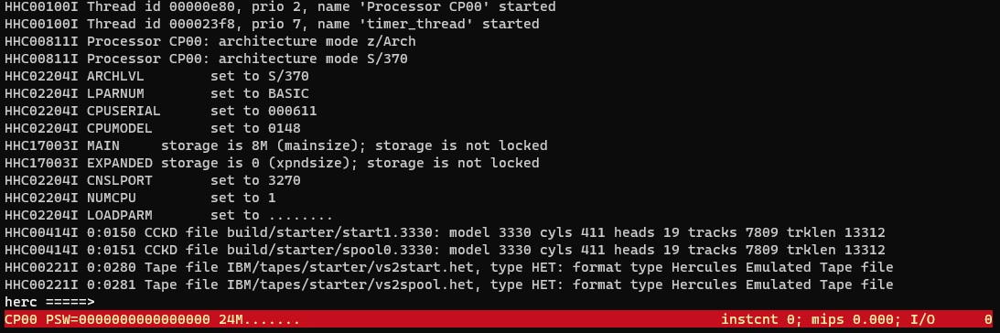  

This is the **Hercules Command Window** where you can enter commands to the emulator.

If you press ESCAPE on this screen you activate a toggle switching between the HERCULES COMMAND WINDOW and the HERCULES CONTROL PANEL shown below

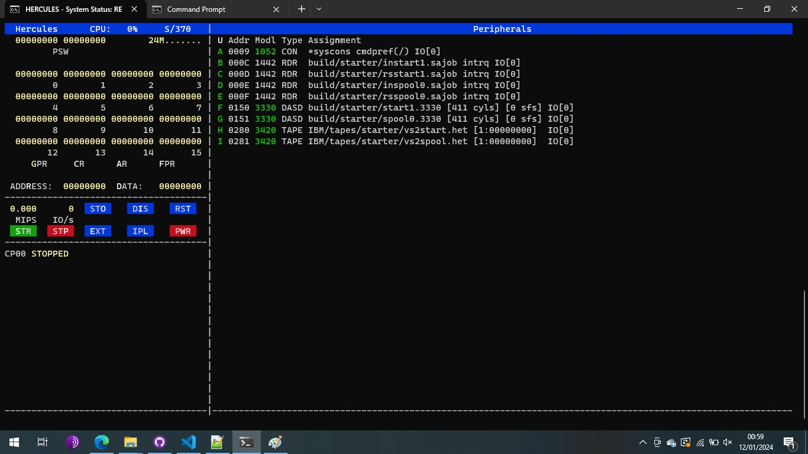  

The HERCULES CONTROL PANEL shows the registers and buttons on the left and a list of addresses of devices on the right. If you press the **?** key you are presented with a list of commands you can issue in this view.

 
3. IPL from tape at address 280

Enter the following command in the Hercules COMMAND Window:

```
ipl 280
```

Alternatively, hit ESCAPE to switch to the CONTROL PANEL and then press 

```
L
H
```

This presses the IPL button and then selects device *H* 

> H 0280 3420 TAPE IBM/tapes/starter/vs2start.het [1:00000000]  IO[793]

Pressing the IPL button in this manner issues the IPL 280 command at the HERCULES COMMAND WINDOW. This can be more satifying to the user as an emulation than typing *IPL 280* and is included as an alternative method.


----


> If the user wishes they can use a GUI front end to Hercules like any of the following.
>
>Windows:
>- [HercGUI by Software Development Laboratories](http://softdevlabs.com/hercgui.html)
>- [Jason by Olly](https://www.ollydbg.de/Jason/index.htm)
>
>Linux:
>- [HRDPLEX-GUI](https://github.com/haynieresearch/hrdplex-gui)
>   

You should not get any errors with the HET tapes provided in the distribution if you use the included Hercules as described. 

> If you receive the error message: 
> 
>   HHCCP029E S/370 mode IPL failed: CSW status=0D00
> 
> Jay Moseley recommends first check the validity of the archive that contains the tape images and the tape images themselves after they are extracted using the MD5 sums provided, and verify that the tape images were extracted to the tape directory.  If the MD5 sums prove the tape images are valid, ensure that your version of Hercules has been built with zlib and bzip support.  These are the three reasons that can cause this error message from the Hercules emulator.

---

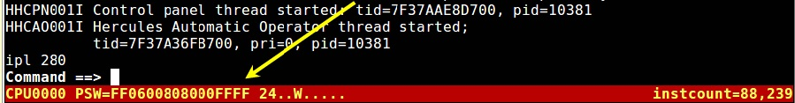  

Hercules runs an IPL from the tape drive at address 280. This runs the DASDI program which appears first on the tape.

However, this requires some input from the console.

In our configuration file [build.starter/ibcdmprs.cnf](starter/ibcdmprs.cnf) we have configured our console (the default 1052 console at address 009) to use the internal Hercules 1052 console /. To use this console we have to prefix any console commands with the '/' character. In later configurations we will actually use other consoles and use such tools as telnet and a 3270 terminal to connect with, but for now we will use the internal Hercules console ('/').

If we enter a single / and then press return or enter we will issue a blank command entry to the internal console (effectively just hitting ENTER at the console - aka saying wake up to the console). The console returns with the output of the DASDI program and waits for a response.

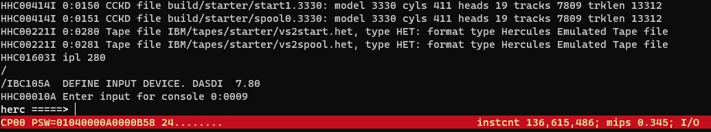  

These stand-alone programs require commands to be given to them to tell them what to do. In principle this is similar to JCL commands (but in a different format), or the built in MVS utilities that require commands to be given to them.

In our case we need to tell the DASDI program where to read the commands from in order to have te DASDI program initialize the START1 DASD volume. 

Here we need to tell DASDI to use a 1442 device (a card reader) at address 00c which the configuration file has specified that the job [instart1.sajob](starter/instart1.sajob) has been loaded. If you look at that job gives instructions specifying where to find the target device and what to label it as ([inspool0](starter/inspool0.sajob) does a similar thing for spool0.3330).

To direct DASDI to the 1442 card reader at address 00c we issue the command

```
/input=1442,00c
```

> [!NOTE] We need the leading / as we are using the Hercules internal console: if we had configured Hercules not to use the internal console we would have to connect a telnet session here.

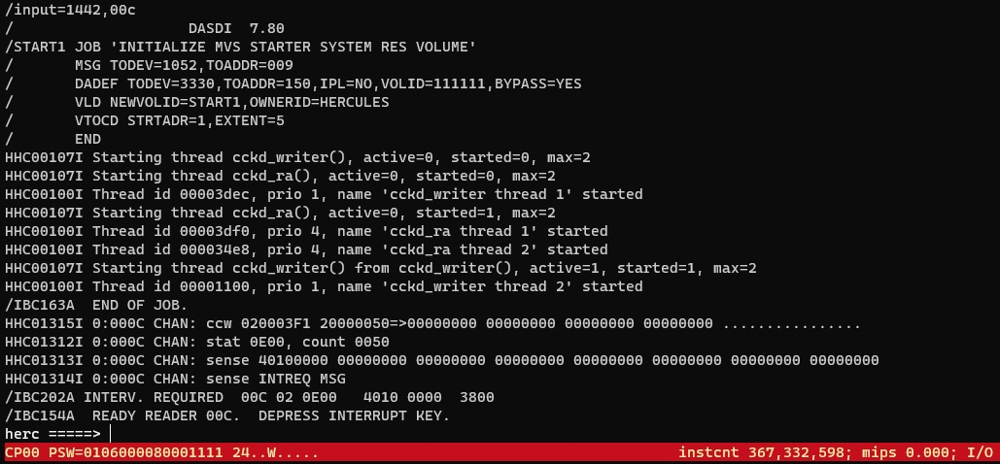 

We see in the output that the reader read in a series of commands from the instart1.sajob card deck and then run the job.

We see in the output the end of job message:

```
/IBC163A  END OF JOB. 
```


The job runs leaving the PSW=0106000080001111 indicating the DASDI program has successfully completed the initialization.

```
PSW=0106000080001111 
```

At the front of each tape there are two stand-alone programs that we will be using. After each sajob (stand-alone job) the tape will be correctly positioned for the next step.

The second step is to restore the starter system image from the tape, which follows the stand-alone program on the tape (in the third position).

On the hercules command line issue the **stop** command to stop the machine (or alternatively hit the P key for the STP/STOP button on the visual console). This stops the machines processors.


### Restore the START1 tape

We can then re-ipl the mainframe from the same tape device again by issuing the command:

```
ipl 280
```

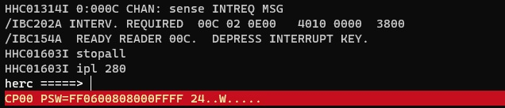 

As before the machine loads the DASDI program from tape at address 280. This time the PSW=FF0600808000FFFF. Again we can check this by connecting the internal console with the empty '/' command as before.

This time we will use the second card deck at reader 00d:

```
/input=1442,00d
```

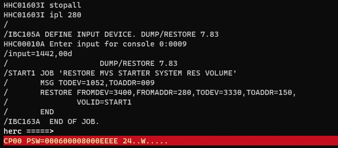 

Again we will see the job being read from the cards in the Hercules window and the PSW showing as PSW=000600008000EEEE.

That completes the process for the START1 volume. It was much quicker than a restore from/to real hardware.


Next we will restore the SPOOL0 volume with the same process but using the tape mounted at addres 281.

First stop the mainframe by entering **stop** at the Hercules command window:

```
stop
```

### Initialize the SPOOL0 volume

Next we IPL from address 281 loading from the next tape.

```
ipl 281
```

We will now be at PSW=FF0600808000FFFF.

This again loads the DASDI program from tape and again we will connect to the internal console with the empty console command '/':

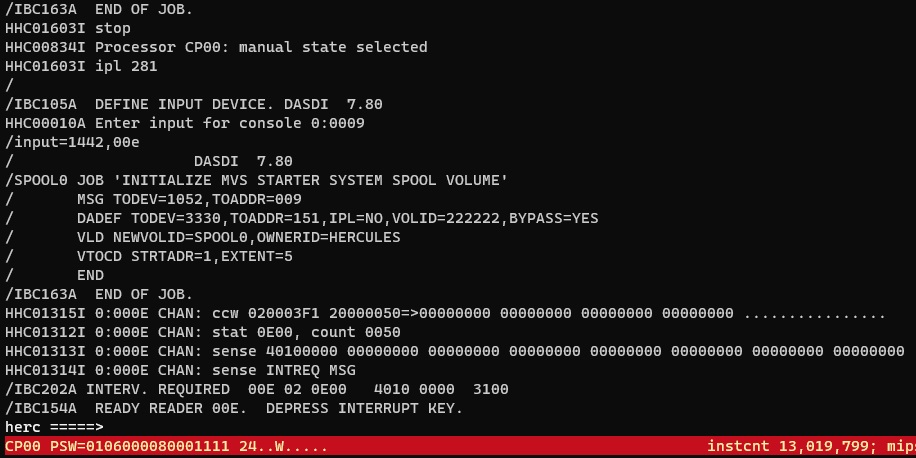 

The job runs leaving the PSW=0106000080001111 with the 1111 indicating the DASDI program has successfully completed the initialization.

### Restore the SPOOL0 tape

Again we will stop the processor and the IPL again from 281 just like with did with the tape on 280 for the START1 volume.

At the Hercules command prompt enter 

```
stop
ipl 281
```

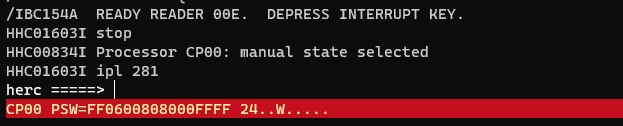 

Finally we will load the sajob from the fourth reader on 

```
/
/input=1442,00f
```

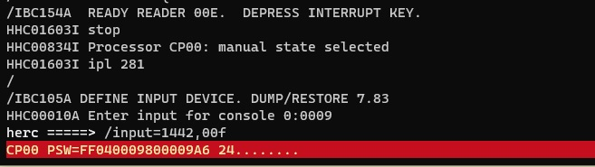 

Our job completed successfully with PSW ending in EEEE.

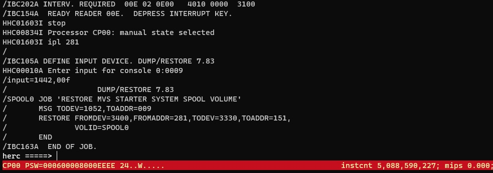


We have now completed restoring both the START1 and SPOOL0 DASDs and our starter system is fully restored.

Issue a **stop** to stop the CPUs and a **quit** to quit the emulator.

```
stop
quit
```

Hercules displays a number of messages as it shuts down.

## Create a backup

At this point it would be a good opportunity to create a backup of the 

To backup you could just copy the directory somewhere. But in our case as tar has come to Windows back in 2017, and it is a standard tool on Linux and MacOS  (although some Linux distributions you may need to install it with your package manager) we will use tar for cross platform compatibility.

Start a Windows/Linux/MacOS terminal or command shell and from the **distribution directory**:

```
cd build 
tar cvf backups/starter.tar starter/*
```
This will produce an output similar to 

```
> tar cvf backups/starter.tar starter
a starter
a starter/create_starter_dasd.bat
a starter/create_starter_dasd.sh
a starter/ibcdmprs.cnf
a starter/images
a starter/inspool0.sajob
a starter/instart1.sajob
a starter/rsspool0.sajob
a starter/rsstart1.sajob
a starter/spool0.3330
a starter/start1.3330
a starter/images/hercules_control_panel.jpg
a starter/images/starter0.jpg
a starter/images/starter1.jpg
a starter/images/starter2.jpg
a starter/images/starter3.jpg
a starter/images/starter4.jpg
a starter/images/starter5.jpg
a starter/images/starter6.jpg
a starter/images/starter7.jpg
a starter/images/starter8.jpg
a starter/images/starter9.jpg
```

You can check the contents of this tar backup with the command 

```
tar tvf backups/starter.tar
```

And if you feel the need to restore your starter DASDs because something went wrong for you after this point you can restore with 

```
cd build
tar xvf starter/starter.tar
```

## Next steps

Please continue with the installation in the next section [Using SMP4 to Build the Distribution Libraries](Using_SMP4_to_Build_the_Distribution_Libraries.md).